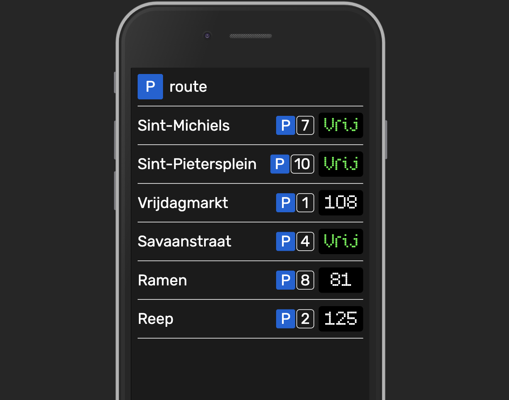

# Parking App Assignment

## Introduction

This assignment will test your ability to create a basic light-weight frontend using a JS framework which consumes open data.

We've set up some goals that you should meet, as well as ideas for some extras that you can include to totally blow us away 😏... But basically you're going to create this:



We estimate that this assignment should take about **5 hours of work** spread out over about a week's time. We'd also like to point out that you may deviate from the set goals if you would like to show off something not on the list.

## Specification

The idea is that you create a **parking spots app**. This app allows a user to **see which parking garages are free**. Since we have to use **open data**, we're going to use the readily available endpoint from the **Ghent API.**

The endpoint for the Ghent parking lots is here:
```
https://datatank.stad.gent/4/mobiliteit/bezettingparkingsrealtime.json
```

The app should only have one main view in which you get an overview of all available spots, and should be exactly the same as its real-world counterpart:


So this means there should be a list of parking lots, with their respective unique identifiers, and status indicators, which will show either `Free`, remaining free spots `XXX` underneath a certain threshold, and `FULL` in the correct colors.

Simple and practical is what this app should be, and therefore it'd be nice if this becomes easy to install as well. This can be achieved by making steps turning this into a PWA (Progressive Web App), this part is optional though.

Make sure that you `git init` your project before you start developing, and commit from time to time so you make your progress transparent. Just make sure you don't have 1 or 2 commits with a huge load of changes.

## Goals

We've made a list of goals your version of the app should meet:
- [ ] Use a frontend framework: `Vue, Angular, React, Ember, ...`
- [ ] All progress versioned with GIT: `commit often and be descriptive`
- [ ] Have an overview of parking lots as a list
- [ ] Display real-time* occupation data from the Ghent API per parking lot
- [ ] Make it graphically look similar to its real-world counterpart
- [ ] `OPTIONAL` Turn it into a PWA
- [ ] `OPTIONAL` Make detail views per parking lot, and see what other cool things you can display
- [ ] `REALLY OPTIONAL` Do something with the GPS sensor in the device, and the location of a parking lot, to make navigation to a selected parking lot intuitive and easy

Once again, this list of goals is only a point of reference. You may deviate from this list if you want to implement a certain technology or feature to totally blow us away! We're curious about anything you might want us to see!

\* The API only updates its data at a certain interval, so polling the data is acceptable

## Assets

We've included a font called `SubwayTicker`. You don't have to use it, BUT we do really want you to use a cool realistic looking LCD font for the indication of the parking spots.

## Handing in

The goal is to try and complete this assignment within a week's time. Fork this GitHub repo and continue on from there, so we can see how you did afterwards.

What we will do is:
* We will clone your repo at the end of the working period
* We will check to see what you've managed to do
* We will approve a project based on how it works, time spent, and how you wrote it in code

Good luck, and enjoy! 😊
